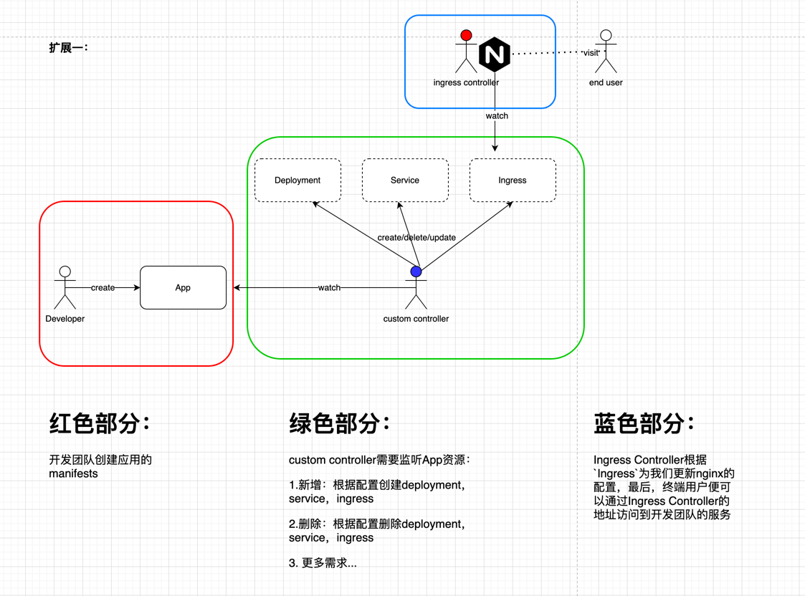

# 使用kubebuilder实现自定义controller

### 需求


### 生成代码

```shell
kubebuilder create api --group ingress --version v1beta1 --kind App
```

### 修改app_types.go

首先，我们需要定义好自定义的资源，我们这里指定为App，我们希望开发团队能够声明一个App
的资源，然后由我们的自定义controller根据其配置，自动为其创建deployment、service、
ingress等资源。

定义如下：

```yaml
type AppSpec struct {
  // INSERT ADDITIONAL SPEC FIELDS - desired state of cluster
// Important: Run "make" to regenerate code after modifying this file

  EnableIngress bool `json:"enable_ingress,omitempty"`
  EnableService bool `json:"enable_service"`
  Replicas    int32  `json:"replicas"`
  Image string	`json:"image"`
}
```

其中Image、Replicas、EnableService为必须设置的属性，EnableIngress可以为空.

### 重新生成crd资源

```shell
make manifests
```

### 实现Reconcile逻辑

1. App的处理

```go
	logger := log.FromContext(ctx)
	app := &ingressv1beta1.App{}
	//从缓存中获取app
	if err := r.Get(ctx, req.NamespacedName, app); err != nil {
		return ctrl.Result{}, client.IgnoreNotFound(err)
	}
```

2. Deployment的处理

之前我们创建资源对象时，都是通过构造golang的struct来构造，但是对于复杂的资源对象
这样做费时费力，所以，我们可以先将资源定义为go template，然后替换需要修改的值之后，
反序列号为golang的struct对象，然后再通过client-go帮助我们创建或更新指定的资源。

我们的deployment、service、ingress都放在了controllers/template中，通过
utils来完成上述过程。

```go
	//根据app的配置进行处理
	//1. Deployment的处理
	deployment := utils.NewDeployment(app)
	if err := controllerutil.SetControllerReference(app, deployment, r.Scheme); err != nil {
		return ctrl.Result{}, err
	}
	//查找同名deployment
	d := &v1.Deployment{}
	if err := r.Get(ctx, req.NamespacedName, d); err != nil {
		if errors.IsNotFound(err) {
			if err := r.Create(ctx, deployment); err != nil {
				logger.Error(err, "create deploy failed")
				return ctrl.Result{}, err
			}
		}
	} else {
		if err := r.Update(ctx, deployment); err != nil {
			return ctrl.Result{}, err
		}
	}
```

3. Service的处理
```go
	//2. Service的处理
	service := utils.NewService(app)
	if err := controllerutil.SetControllerReference(app, service, r.Scheme); err != nil {
		return ctrl.Result{}, err
	}
	//查找指定service
	s := &corev1.Service{}
	if err := r.Get(ctx, types.NamespacedName{Name: app.Name, Namespace: app.Namespace}, s); err != nil {
		if errors.IsNotFound(err) && app.Spec.EnableService {
			if err := r.Create(ctx, service); err != nil {
				logger.Error(err, "create service failed")
				return ctrl.Result{}, err
			}
		}
		//Fix: 这里还需要修复一下
	} else {
		if app.Spec.EnableService {
			//Fix: 当前情况下，不需要更新，结果始终都一样
			if err := r.Update(ctx, service); err != nil {
				return ctrl.Result{}, err
			}
		} else {
			if err := r.Delete(ctx, s); err != nil {
				return ctrl.Result{}, err
			}

		}
	}
```

4. Ingress的处理
```go
	//3. Ingress的处理,ingress配置可能为空
	//TODO 使用admission校验该值,如果启用了ingress，那么service必须启用
	//TODO 使用admission设置默认值,默认为false
	//Fix: 这里会导致Ingress无法被删除
	if !app.Spec.EnableService {
		return ctrl.Result{}, nil
	}
	ingress := utils.NewIngress(app)
	if err := controllerutil.SetControllerReference(app, ingress, r.Scheme); err != nil {
		return ctrl.Result{}, err
	}
	i := &netv1.Ingress{}
	if err := r.Get(ctx, types.NamespacedName{Name: app.Name, Namespace: app.Namespace}, i); err != nil {
		if errors.IsNotFound(err) && app.Spec.EnableIngress {
			if err := r.Create(ctx, ingress); err != nil {
				logger.Error(err, "create service failed")
				return ctrl.Result{}, err
			}
		}
		//Fix: 这里还是需要重试一下
	} else {
		if app.Spec.EnableIngress {
            //Fix: 当前情况下，不需要更新，结果始终都一样
			if err := r.Update(ctx, ingress); err != nil {
				return ctrl.Result{}, err
			}
		} else {
			if err := r.Delete(ctx, i); err != nil {
				return ctrl.Result{}, err
			}
		}
	}
```

5. 删除service、ingress、deployment时，自动重建

```go
func (r *AppReconciler) SetupWithManager(mgr ctrl.Manager) error {
	return ctrl.NewControllerManagedBy(mgr).
		For(&ingressv1beta1.App{}).
		Owns(&v1.Deployment{}).
		Owns(&netv1.Ingress{}).
		Owns(&corev1.Service{}).
		Complete(r)
}
```


### 测试

#### 安装ingress controller

我们这里使用traefik作为ingress controller。

```shell
cat <<EOF>> traefik_values.yaml
ingressClass:
  enabled: true
  isDefaultClass: true #指定为默认的ingress
EOF

helm install traefik traefik/traefik -f traefik_values.yaml 
```

#### 安装crd

```shell
make install
```

#### 部署自定义controller

> 开发时可以直接在本地调试。

1. 构建镜像
```shell
IMG=wangtaotao2015/app-controller make docker-build
```
2. push镜像
```shell
IMG=wangtaotao2015/app-controller make docker-push
```

3. 部署
> fix: 部署之前需要修改一下controllers/app_controller.go的rbac
> ```yaml
>//+kubebuilder:rbac:groups=apps,resources=deployments,verbs=get;list;watch;create;update;patch;delete
>//+kubebuilder:rbac:groups=networking.k8s.io,resources=ingresses,verbs=get;list;watch;create;update;patch;delete
>//+kubebuilder:rbac:groups="",resources=services,verbs=get;list;watch;create;update;patch;delete
> ```
```shell
IMG=wangtaotao2015/app-controller make deploy
```

#### 验证

1. 创建一个app

```shell
kubectl apply -f config/samples
```

2. 检查是否创建了deployment

3. 修改app，看service、ingress是否能被创建

4. 访问ingress，看是否可以访问到服务


### 遗留问题

1. enable_ingress默认为false, webhook将该值设置为反向值
2. 当设置enable_ingress为true时，enable_service必须设置为true

我们将通过admission webhook来解决。
