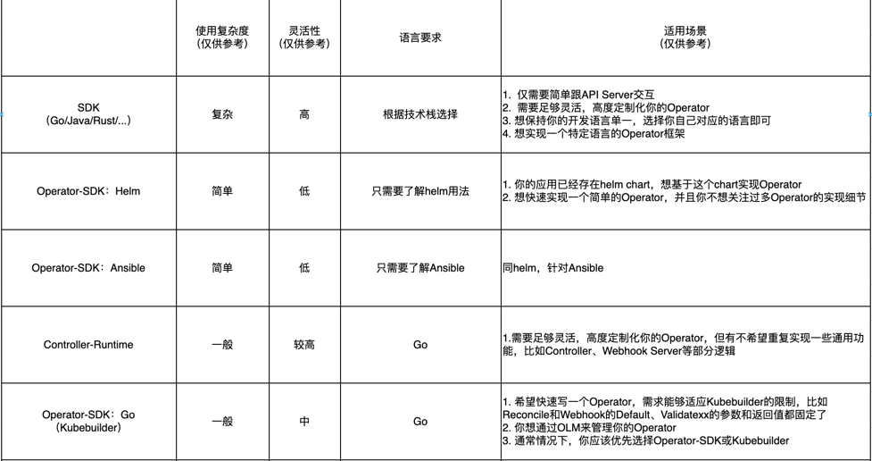

# Operator-SDK介绍

前面我们对client-go/kubebuilder进行了了解和学习，从这节课开始我们来了解另外一个编写Operator的工具operator-sdk。它属于[operator-framework](https://github.com/operator-framework)的一个子项目，
使用它可以快速的基于golang、helm、ansible写出我们的operator。其中，golang的实现基于kubebuilder来实现的。
前面我们已经对kubebuilder进行了学习。helm和ansible使用方法类似，我们将会基于helm来重写我们前面课程的operator。最后，我们会通过对olm进行学习，并用OLM来管理我们基于helm写出的operator。

## Helm实现Operator

### 创建helm chart

1. 我们先将app的应用创建一个helm chart。

```shell
helm create app-chart
```
> helm chart可以放在本地或者远程。

2. 查看chart的结果是否正确

```shell
helm template app-chart
```


### 安装operator-sdk

参考https://sdk.operatorframework.io/docs/installation/

### 创建项目

> 可通过 operator-sdk init --plugins helm --help 查看完整使用方法

```shell
mkdir helm
cd helm
operator-sdk init --plugins helm --domain baiding.tech --group ingress --version v1alpha1 --kind App --helm-chart ../app-chart
```

### 测试operator

1. 安装crd并在本地启动operator

```shell
make install
make run
```
2. 修改config/samples/ingress_v1alpha1_app.yaml进行验证

### 部署operator

1. 构建镜像和部署到集群

```shell
make docker-build docker-push IMG=wangtaotao2015/operator-helm-demo:v0.0.1
```

```shell
make deploy IMG=wangtaotao2015/operator-helm-demo:v0.0.1
```

### 其他需求
1. 删除helm里面的资源后如何重建?

  本身已经支持了。
  
2. helm里面的默认值如何覆盖?

  olm小节中讲解了。
  
3. 如何校验自定义资源?
 
  用helm的hooks功能实现。

## Operator生命周期管理(OLM)
OLM也是[operator-framework](https://github.com/operator-framework)的一个子项目，本质上就是2个Operator（olm-operator和catalog-operator）。只不过这个Operator是用来管理其他operator得生命周期的。

1. 安装OLM

将会安装OLM对应的CRD、RBAC等资源，同时会部署olm-operator和catalog-operator两个operator。
```shell
operator-sdk olm install --version v0.21.2
```
> 卸载可以使用 operator-sdk olm uninstall --version v0.21.2
> 查看状态使用 operator-sdk olm status

2. 用OLM部署operator
> 先将之前用make deploy的清理掉。
> make uninstall && make undeploy

- 生成operator相关配置
```shell
make bundle IMG=wangtaotao2015/operator-helm-demo:v0.0.1 VERSION=0.0.1
```
- 构建bundle镜像
```shell
make bundle-build bundle-push BUNDLE_IMG=wangtaotao2015/operator-helm-demo-bundle:v0.0.1
```

- OLM部署operator
```shell
operator-sdk run bundle docker.io/wangtaotao2015/operator-helm-demo-bundle:v0.0.1 --timeout 10m
```

- 升级operator版本
> 修改helm的values.yaml设置enable_ingress: false,然后重新构建镜像
```shell
make bundle IMG=wangtaotao2015/operator-helm-demo:v0.0.2 VERSION=0.0.2
make bundle-build bundle-push BUNDLE_IMG=wangtaotao2015/operator-helm-demo-bundle:v0.0.2
operator-sdk run bundle-upgrade docker.io/wangtaotao2015/operator-helm-demo-bundle:v0.0.2 --timeout 10m
```


## Operator工具对比

我们可以使用哪些operator工具来帮我们实现operator。



其他Operator工具:
1. [Java Operator SDK](https://github.com/java-operator-sdk/java-operator-sdk)
2. [kudo](https://kudo.dev/)
3. [Kubernetes Operator Pythonic Framework (KOPF)](https://kopf.readthedocs.io/)
4. [Shell-Operator](https://github.com/flant/shell-operator)
5. [MetaController](https://github.com/metacontroller/metacontroller)

## 参考文档

https://sdk.operatorframework.io/docs/building-operators/helm/

https://sdk.operatorframework.io/docs/building-operators/helm/reference/watches/

https://helm.sh/docs/topics/charts_hooks/

https://olm.operatorframework.io/docs/
