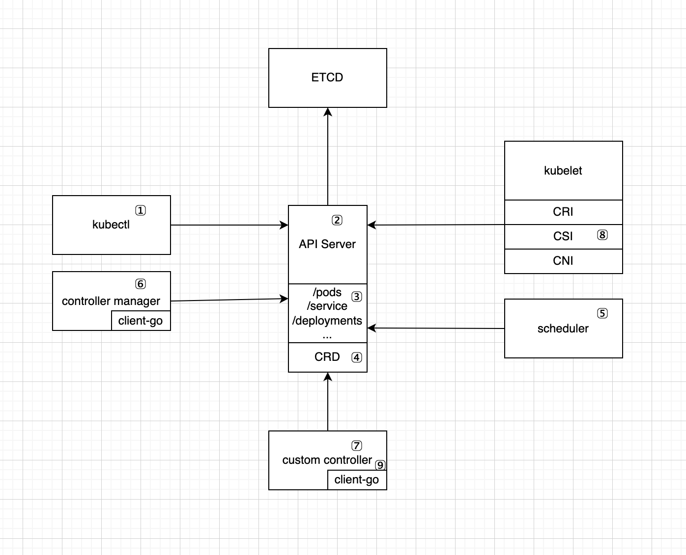

<!--
_class: lead
-->
# K8S介绍

---

## K8S的内置资源

- Pod：K8S最小的调度单元，可以将一组密切关联的容器组成一个逻辑单元，在这个单元里容器之间可以更好的共享资源。
- Deployment：主要用于无状态应用，用来部署多个副本的Pod，并且在Pod出现异常时帮助应用及时恢复正常。
- Statefulset：主要用于有状态应用，可以控制Pod的启动顺序，为Pod绑定不同的存储等。
- Job/CronJob：用于一次性和周期性的任务。
- Daemonset：通常用来部署后台常驻任务，会在每台Worker节点启动。

---

## K8S的内置资源(续)

- Service：应用的访问入口，通过selector选择具有指定label的Pod，为其提供服务发现和负载均衡的功能，每个Service都可以通过CoreDNS获取到其对应的IP。
- Ingress：提供K8S集群外部访问应用。
- Configmap、Secret：描述应用的配置和密钥等数据。
- PV、PVC、HostPath、EmptyDir：描述应用的各类存储。
- ...

---

## K8S的扩展点

---

## K8S控制器模式

在机器人技术和自动化领域，控制回路（Control Loop）是一个非终止回路，用于调节系统状态。将其应用到K8S中，控制器的含义是通过监控集群的公共状态，并致力于将当前状态转变为期望的状态。至于如何转变，由控制器的控制循环处理相应的逻辑。一个控制器至少追踪一种类型的 Kubernetes 资源。该资源的控制器负责确保其当前状态（Status）接近期望状态（Spec）。不同的控制器可以相互配合完成一项复杂的任务。

---

## K8S控制器模式(续)

不论是内置资源的控制器还是自定义资源的控制器，我们都会通过client-go来于API Server进行交互，而在client-go中，为我们提供了控制器的大部分实现，我们只需要在此基础上通过少量代码便可以写出符合K8S设计原则的控制器。

接下来，我们进入到client-go的学习。
