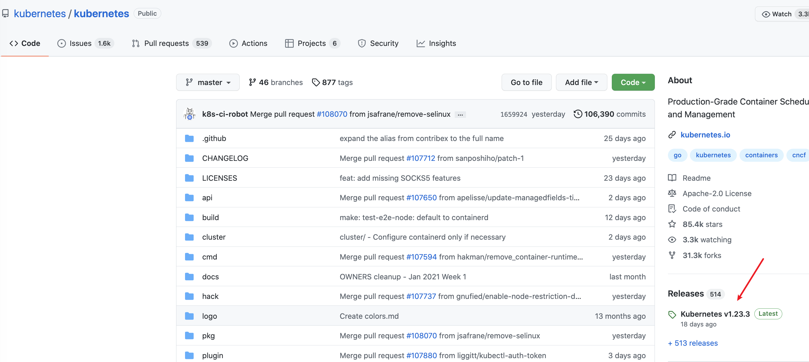
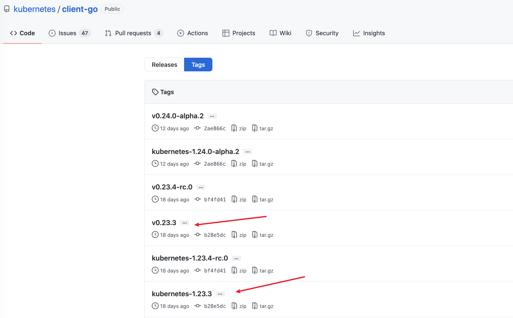

<!--
_class: lead
-->
# RESTClient原理

---
# 环境要求
#### K8S版本：v1.23.3
```
minikube start --registry-mirror=https://registry.docker-cn.com  --image-mirror-country cn --kubernetes-version=v1.23.3
```
#### client-go版本: v0.23.3
 

---


---

# Client类型

- `RESTClient`： 最基础的客户端，提供最基本的封装
- `Clientset`：是一个Client的集合，在Clientset中包含了所有K8S内置资源的Client，通过Clientset便可以很方便的操作如Pod、Service这些资源
- `dynamicClient`：动态客户端，可以操作任意K8S的资源，包括CRD定义的资源
- `DiscoveryClient`：用于发现K8S提供的资源组、资源版本和资源信息，比如：`kubectl api-resources`

---

# RESTClient的使用
- `RESTClientFor`: 为创建`RESTClient`准备config，比如限速器、编解码器等
- `UnversionedRESTClientFor`: 与`RESTClientFor`类似，只是允许config.GroupVersion为空

```
    ...
    config, err := clientcmd.BuildConfigFromFlags("", *kubeconfig)
    ...
    client, err := RESTClientFor(config)
```

---

# Clientset的使用

```
    ...
    config, err := clientcmd.BuildConfigFromFlags("", *kubeconfig)
    if err != nil {
        panic(err)
    }
    clientset, err := kubernetes.NewForConfig(config)
    deploymentsClient := clientset.AppsV1().Deployments()
    ...
```

---

# dynamicClient的使用

```
    ...
	config, err := clientcmd.BuildConfigFromFlags("", *kubeconfig)
	if err != nil {
		panic(err)
	}
	client, err := dynamic.NewForConfig(config)
    ...
```

---

# DiscoveryClient的使用

```
    ...
	config, err := clientcmd.BuildConfigFromFlags("", *kubeconfig)
	if err != nil {
		panic(err)
	}
	client, err := discovery.NewDiscoveryClientForConfig(config)
    ...
```

另外还有两个DiscoveryClient，分别支持将数据缓存在磁盘文件或内存当中

---
<!--
_class: lead
-->
### 谢谢