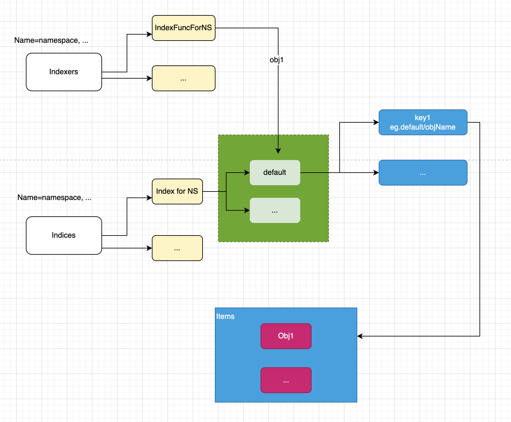
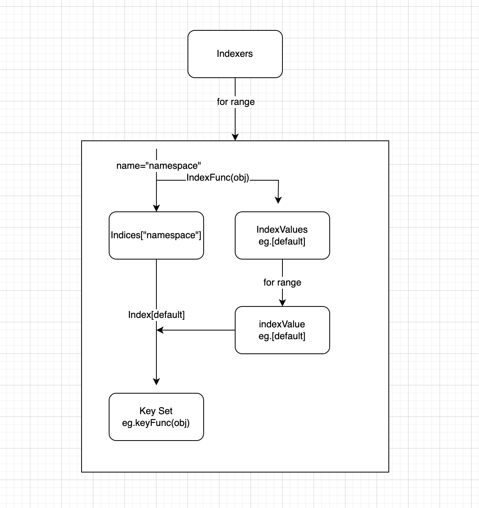

<!--
_class: lead
-->

# Indexer原理
---


---
# 数据存储

`cache`委托`threadSafeMap`存放数据
```
type Indexer interface {
	Store
	Index(indexName string, obj interface{}) ([]interface{}, error)
	IndexKeys(indexName, indexedValue string) ([]string, error)
	ListIndexFuncValues(indexName string) []string
	ByIndex(indexName, indexedValue string) ([]interface{}, error)
	GetIndexers() Indexers
	AddIndexers(newIndexers Indexers) error
}
```

---
# 建立索引
```go
//key是IndexFunc计算出来的结果，比如default，value是所有obj的key的集合
type Index map[string]sets.String

//key是索引的分类名，比如namespace，value是一个方法，通过该方法可以获取obj的namespace，比如default
type Indexers map[string]IndexFunc

//key是索引的分类名，比如namespace
type Indices map[string]Index
```


---

# 更新索引

通过`updateIndices`实现。



---


<!--
_class: lead
-->
### 谢谢