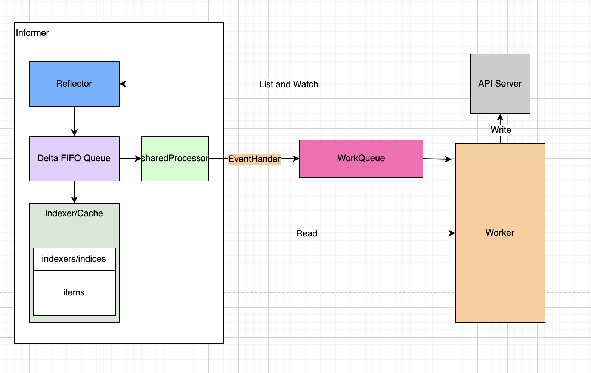

<!--
_class: lead
-->

# WorkQueue原理
---



---
# 队列类型

- 通用队列
- 延迟队列
- 限速队列

---
# 通用队列

```
type Interface interface {
   Add(item interface{})  // 添加一个元素
   Len() int              // 队列元素个数
   Get() (item interface{}, shutdown bool) // 获取一个队列元素
   Done(item interface{}) // 标记一个元素已经处理完
   ShutDown()             // 关闭队列
   ShuttingDown() bool    // 是否正在关闭
}
```

---
# 通用队列(续)

```
type Type struct {
   queue []t            // 定义队列，具有顺序性，待处理元素列表
   dirty set            // 标记所有需要被处理的元素
   processing set       // 当前正在被处理的元素

   cond *sync.Cond      
   shuttingDown bool    // 是否正在关闭
   metrics queueMetrics
   unfinishedWorkUpdatePeriod time.Duration
   clock                      clock.Clock
}
```
思考：为什么需要3个数据结构?

---
# 延迟队列

```
type DelayingInterface interface {
   Interface
   //延迟添加 
   AddAfter(item interface{}, duration time.Duration)
}
```

---
# 延迟队列(续)

```
type delayingType struct {
   Interface               // 用来嵌套普通 Queue
   clock clock.Clock       // 计时器
   stopCh chan struct{}
   stopOnce sync.Once    
   heartbeat clock.Ticker 
   waitingForAddCh chan *waitFor  // 传递 waitFor 的 channel，默认大小 1000
   metrics retryMetrics
}
```
重要方法：waitingLoop/AddAfter

---
# 限速队列
```
type RateLimitingInterface interface {
   DelayingInterface                   // 延时队列里包含了普通队列，限速队列里包含了延时队列
   AddRateLimited(item interface{})    // 往队列里加入一个元素
   Forget(item interface{})            // 停止元素重试
   NumRequeues(item interface{}) int   // 记录这个元素被处理多少次了
}
```

---
# 限速队列(续)

限速器的目的: 根据相应的算法获取元素的延迟时间，然后利用延迟队列来控制队列的速度

```
type RateLimiter interface {
   When(item interface{}) time.Duration // 返回一个 item 需要等待的时常
   Forget(item interface{})             // 标识一个元素结束重试
   NumRequeues(item interface{}) int    // 标识这个元素被处理里多少次了
}
```

---
<!--
_class: lead
-->
### 谢谢