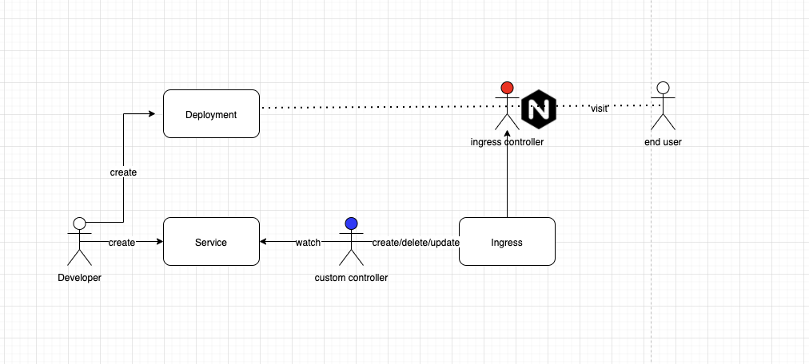

<!--
_class: lead
-->

# client-go项目实战(上)

### 需求说明

---

### 需求

运维团队希望管控部署在k8s集群里对外暴露的服务，开发团队无需关心服务如何暴露给用户的

---
### 解决方案

---

### 解决方案(续)

1. 开发团队创建应用的manifests，开发团队可以为Service资源添加`annotation` 为 `ingress/http:true` 来决定终端用户是否可以访问到该服务，默认不能访问到。至于具体如何让用户可以访问到服务，开发团队不需要关心 
2. custom controller需要监听Service资源，当Service发生变化时：

   - 如果新增Service时:
     - 包含指定annotation，创建Ingress资源对象
     - 不包含指定annotation，忽略
   - 如果删除Service时：
     - 删除Ingress资源对象
   - 如果更新Service时：
     - 包含指定annotation，检查Ingress资源对象是否存在，不存在则创建，存在则忽略
     - 不包含指定annotation，检查Ingress资源对象是否存在，存在则删除，不存在则忽略

3. Ingress Controller根据`Ingress`为我们更新nginx的配置，最后，终端用户便可以通过Ingress Controller的地址访问到开发团队指定的服务
